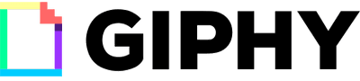

[](https://create-react-app.dev/docs)
[](https://expressjs.com/)
[](https://reactstrap.github.io/)
[](https://github.com/prettier/prettier)
[](https://github.com/airbnb/javascript)
[](https://devcenter.heroku.com/categories/reference)

---

<br />
<p align="center">
  <a href="https://gipphy.herokuapp.com">
    
  </a>
<br />
<br />
  <p align="center">
Giphy la herramienta que te donde puedes encontrar los mejores y espectaculares GIFs con que expresarte y, compartir en todas tus redes.   <br />
    <a href="https://github.com/eriika19/giphy/tree/master/src"><strong>Explorar proyecto »</strong></a>
    <br />
    <br />
    <a href="https://gipphy.herokuapp.com">Ir a Sitio</a>
    ·
    <a href="https://github.com/eriika19/giphy/issues">Reportar Problema</a>
    ·
  </p>
  <br />
</p>
 
 <h3 align="center"> React, Redux-Saga, Bootstrap, GiphyFetch, Express, Eslint, Lint-staged</h3>
 
 <br />

---

# Contenido

- [Acerca del Proyecto](#acerca-del-proyecto)
  - [Herramientas](#_herramientas_)
  - [Próximos alcances](#próximos-alcances)
- [Correr proyecto localmente](#correr-proyecto-localmente)
- [Contacto](#contacto)

 <br />

## Acerca del proyecto 🚀

Esta aplicación se desarrollo como app web que permite visualizar, encontrar y guardar, los mejores
GIFs de manera fácil y rápida. Implementando solicitudes Axios para consumir la API de Giphy

 <br />

### _*Herramientas*_ 🛠️

- [React](https://create-react-app.dev/docs)
- [Redux-Saga](https://github.com/bmealhouse/next-redux-saga)
- [GiphyFetch](https://github.com/Giphy/giphy-js/blob/master/packages/fetch-api/README.md)
- [Express](https://expressjs.com/)
- [Bootstrap](https://reactstrap.github.io/)
- [Hooks](https://es.reactjs.org/docs/hooks-intro.html)
- [Git](https://git-scm.com/)
- [Eslint](https://eslint.org/)
- [Lint-staged](https://openbase.io/js/lint-staged)
- [Husky](https://github.com/typicode/husky)
- [GitHub Emoji Cheat Sheet](https://www.webpagefx.com/tools/emoji-cheat-sheet)
- [Prettier](https://github.com/prettier/prettier)
- [Airbnb Style Guide](https://github.com/airbnb/javascript)

### Próximos alcances

- [ ] Añadir tests en todos los componentes.

## Correr proyecto localmente

Este proyecto puede ser corrido en un equipo local, clonando e instalando localmente las
dependencias requeridas.

### Crear proyecto localmente

Comenzar proyecto de manera locar clonando este repositorio con:

```
$ git clone https://github.com/eriika19/giphy.git
```

### Instalar dependencias

Una vez clonado se debe ir al directorio raíz del proyecto y ejecutar el siguiente comando para
instalar todas las dependencias listadas en el `package.json`:

```
$ yarn
```

### Variables de ambiente

Se deben definir las API_KEY en las variables de ambiente , ya que el repositorio no las incluye. Es
posible correr `cp .env.example .env` para definir las propias variables de ambiente en archivo
`.env`.

Ejemplo:

```shell
REACT_APP_GIPHY_API_KEY=************
```

### Correr proyecto

- Para correr Giphy en un ambiente de desarrollo ejecutar:

```
$ yarn dev
```

- Para correr Giphy en un ambiente de producción ejecutar:

```
$ yarn build
```

- Para correr Giphy en un ambiente de desarrollo ejecutar:

```
$ yarn start
```

Una vez corriendo estará listo en `http://localhost:3000/`

### Ejecutar tests

Para ejecutar los tests correr los siguientes comando:

```
$ yarn test
```

```
$ yarn test:coverage
```

### Prettier and Eslint

Prettier and Eslint se ejecutarán automáticamente al realizar un _commit_.

Sin embargo, también pueden ser ejecutados independentemente con los siguientes comandos:

**Prettier**

```
$ yarn prettier
```

**Eslint**

```
$ yarn lint
```

### Comentarios

Cualquier duda o comentario no dudes en abrir un issue. 😊

---

> ## _Contacto_

Creado con ❤️ por [Itzel Enciso](https://github.com/eriika19)

Sitio Web - [itzelenciso.com](https://itzelenciso.com/)

LinkedIn - [@itzelenciso](https://www.linkedin.com/in/itzelenciso/)

Correo Gmail -
[enciso.iq@gmail.com](<mailto:enciso.iq@gmail.com?subject=Reclutamiento&body=¡Buen día! el motivo de contacto es:>)

¡Gracias por visitar!
